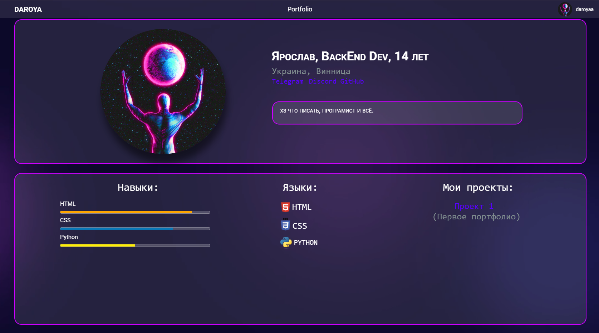

<h1 align="center">✨ DAROYA ✨</h1>

  

  💻 Python & HTML Developer | 🔒 Backend beginner  

---

## 📖 About the project

This project is my portfolio.

My works, experiments and test developments are collected here.

And other information about me. 

---

## 🛠 Technologies used

---

## 📂 Materials and resources

- 📄 The code is written manually in CSS and HTML 
- 🎨 Design - Inspired by GitHub repositories [Sly-Harvey](https://github.com/Sly-Harvey) and others 
- 🖼 Images are mine and free from [Unsplash](https://unsplash.com/)  
- 🛠 Badges — [Shields.io](https://shields.io/)  

---

## 📬 Contacts

